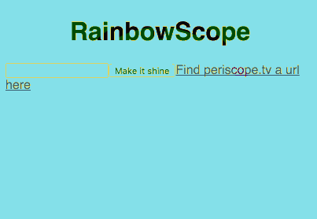
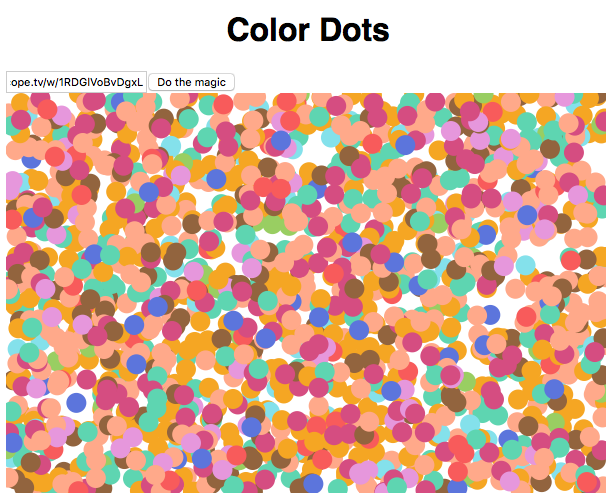

# periscope-art-project

Periscope Art Project, generating live visualization of a Periscope stream.

## Rainbow

First visualization, using Periscope's hearts to draw a rainbow based on live user generated hearts' color.



### Usage

```bash
cd rainbow/
npm i && npm start
```

## Color Dots

Draw color dots using live Periscope's hearts generated by participants.



### Usage

```bash
cd color-dots/
npm i && npm start
```

## Sound

Make sounds based on live Periscope's hearts generated by participants.

This project uses the [Web Audio API](https://developer.mozilla.org/en-US/docs/Web/API/Web_Audio_API).

### Usage

```bash
cd sound/
npm i && npm start
```

## Bubble machine powered by Periscope hearts

Physical installation and hardware project using a Periscope heart stream to power a bubble machine, see [bubblescope](https://github.com/vjo/bubblescope/).

## Credits

Project powered by [peristream](https://github.com/ArnaudRinquin/peristream) and [periscope-participant-colors](https://github.com/vjo/periscope-participant-colors) projects.
