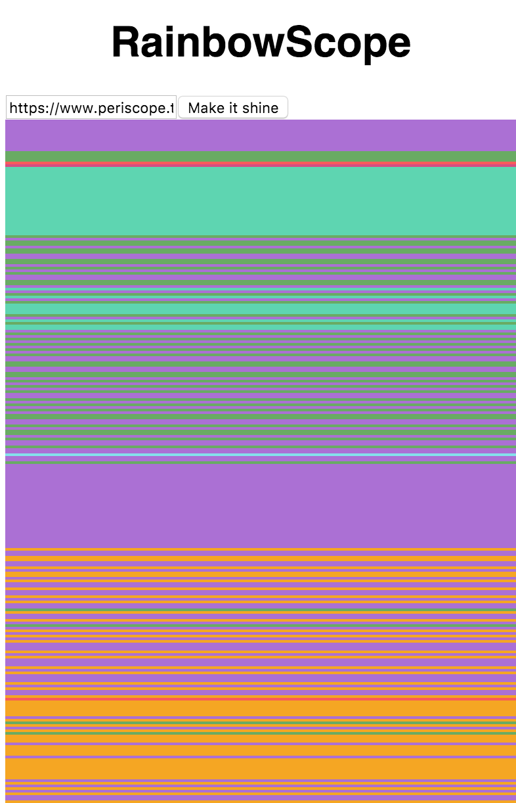

# periscope-art-project
Periscope Art Project, generating live visualization of a Periscope stream.

## Rainbow

First visualization, using Periscope's hearts to draw a rainbow based on live user generated hearts' color.



### Usage

Set a Periscope URL or ID in `rainbow/index.jsx`, line 4.

```bash
npm install
npm start
```

## Bubble machine powered by Periscope hearts

Hardware project using a Periscope heart stream to power a bubble machine, see [bubblescope](https://github.com/vjo/bubblescope/).

## Credits

Project powered by [peristream](https://github.com/ArnaudRinquin/peristream) and [periscope-participant-colors](https://github.com/vjo/periscope-participant-colors) projects.
